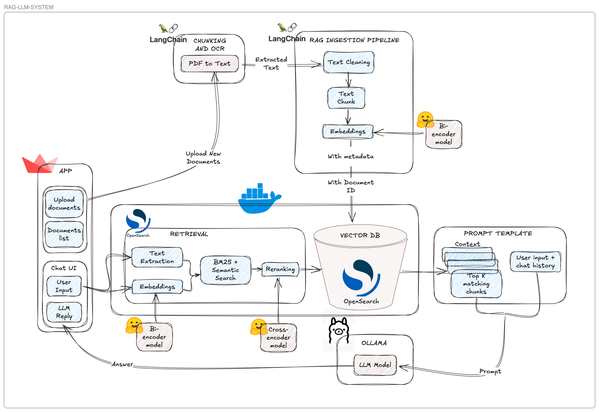
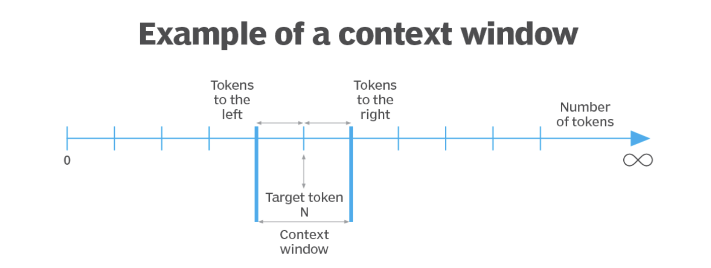
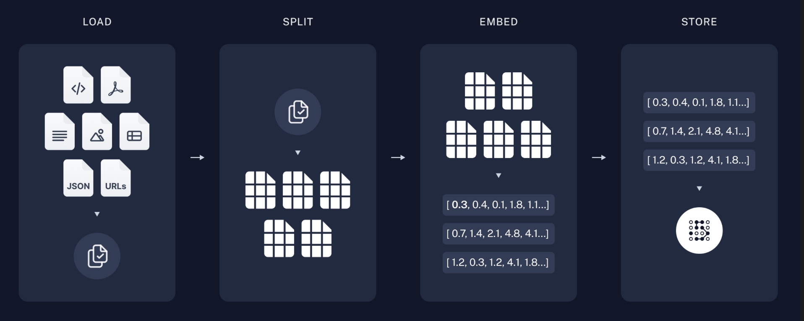

# LOCAL RAG-LLM SYSTEM NOTES

## Introduction

The aim of this file is to have **notes** about the local LLM-RAG system.

## System Design

Below is the diagram of the entire LLM-RAG system.

The main different steps are the following:

- **Streamlit App**: the UI is based on a Streamlit App, where the user can upload their `pdf` documents and chat with the LLM.

- **PDF Loading**: the loading of `pdf` files is done using `langchain` framework that converts the `pdf` files in an usable text format.

- **RAG Ingestion Pipeline**: the RAG Ingestion Pipeline starts with `chunking` the text from the `pdf` to split long documents into managable text chunks. After the `chunking` step, each of these chunks need to be converted into a (dense) vector representation. The vector representation is performed using an `embedding model`.

- **Indexing with OpenSearch**: the extracted text, embeddings and additional features are stored in `OpenSearch` index, which allows document `retrieval` pretty fast.

- **Hybrid Search**: the `retrieval` process is based on hybrid search, therefore the system converts the question into embeddings and queries `OpenSearch` with embeddings and user text using hybrid search. Then teh systems retrieves the top `n` chunks of text (this is a parameter that can be changed via a slider button in the UI). Note that the system part related to hybrid search runs, locally, on a `Docker` container.

- **Prompt Template**: a prompt template has been designed to equip the user with a pre-designed prompt to ask questions to the LLM.

- **LLM via Ollama**: after the `retrieval` process, the top `n` chunks of text are passed to the `LLM` to perform `in context learning`. This enhance the quality of the `LLM` response and reduces the hallucinations. The `LLM` is based on `Ollama` framework, thus it runs completely locally (after pulling the chosen `LLM`).

## Main Steps Deep Dive

### PDF Loading

The loading of the `pdf` files is performed via `langchain` [framework](https://python.langchain.com/v0.2/docs/introduction/).
Langchain is a framework for developing applications using LLMs, nowadays it's one of the most used (open-source) framework used in the GenAI landscape.

To load the `pdf` files two different pdf loaders are used.
The `PyPDFLoader` with `extract_image` set to true.
This is neede in order to perform Optical Character Recognition (`OCR`), namey to extract text from images and thus getting more information from the `pdf` file. `PyPDFLoader` uses `RapidOCR` with `ONNXRuntime` as its backend to perform `OCR` in a fast and efficient way.

However, sometimes due to the size and how the image in the `pdf` page is arranged it could brake.
Therefore, as backup for `pdf` loading the `UnstructuredPDFLoader` is used.

The UnstructuredPDFLoader is a more robust documents loader that can handle a variety of different data formats (`pdf` too). It can handle images of different size and arrangements, and tables but it requires a more complex setup due to its dependence on one of the [following libraries](https://docs.unstructured.io/open-source/installation/full-installation).
The `UnstructuredPDFLoader` is based on the [unstructured](https://github.com/Unstructured-IO/unstructured) library.

Unstructured provides open-source components for ingesting and pre-processing images and text documents, such as PDFs, HTML, Word docs, and many more. The use cases of unstructured revolve around streamlining and optimizing the data processing workflow for LLMs.

Based on the type of file loaded there are different needed libraries, for `pdf` files the backend used by `unstructured` is `tesseract` (or `poppler`).
Tesseract is an open source text recognition (OCR) Engine, it allows to recognize and "read" the text embedded in images (for more info about tesseract check the [link](https://static.googleusercontent.com/media/research.google.com/en//pubs/archive/33418.pdf)).
Tesseract was originally developed at Hewlett-Packard Laboratories Bristol UK and at Hewlett-Packard Co, Greeley Colorado USA between 1985 and 1994, with some more changes made in 1996 to port to Windows, and some C++izing in 1998. In 2005 Tesseract was open sourced by HP. From 2006 until November 2018 it was developed by Google.

### RAG Ingestion Pipeline

This part is the core of the system to create, from the `pdf` files, the **knowledge base** used to enhance via in-context learning the LLM.

#### Chunking (tokenization)

The RAG ingestion pipeline starts with `chunking` the text from the `pdf` to split long documents into managable text chunks, also known as `tokenization`.

>**Info:** tokenizatin and chunking are usually used as synonyms, but they are not exactly the same.

Tokenization is the process of breaking down text into chunks, namely words/subwords/characters known as tokens. Therefore, tokens are the smallest units of text that can be processed by a model.

Tokenization or document splitting or `chunking` is often a crucial preprocessing step for many applications. It involves breaking down large texts into smaller, manageable chunks. This process offers several benefits, such as ensuring consistent processing of varying document lengths, overcoming input size limitations of models, and improving the quality of text representations used in retrieval systems. There are several strategies for splitting documents, each with its own advantages.

There are several reasons to split documents:

- Handling non-uniform document lengths: Real-world document collections often contain texts of varying sizes. Splitting ensures consistent processing across all documents.

- Overcoming model limitations: Many embedding models and language models have maximum input size constraints. Splitting allows us to process documents that would otherwise exceed these limits.

- Improving representation quality: For longer documents, the quality of embeddings or other representations may degrade as they try to capture too much information. Splitting can lead to more focused and accurate representations of each section.

- Enhancing retrieval precision: In information retrieval systems, splitting can improve the granularity of search results, allowing for more precise matching of queries to relevant document sections.

- Optimizing computational resources: Working with smaller chunks of text can be more memory-efficient and allow for better parallelization of processing tasks.

There are different approaches to splitting documents:

- Length-based: the most intuitive strategy is to split documents based on their length. It can be further divided into two categories:

    - Token-based: Splits text based on the number of tokens, which is useful when working with language models.

    - Character-based: Splits text based on the number of characters, which can be more consistent across different types of text

- Text-structured based: Text is naturally organized into hierarchical units such as paragraphs, sentences, and words. We can leverage this inherent structure to inform our splitting strategy, creating split that maintain natural language flow, maintain semantic coherence within split, and adapts to varying levels of text granularity. Therefore it allows for Hierarchical Splitting that attempts to maintain larger units of text, such as paragraphs, intact. If a paragraph exceeds the specified chunk size, it recursively breaks it down into smaller units, such as sentences, and continues this process down to the word level if necessary. This approach helps to keep semantically related pieces of text together, which is beneficial for downstream tasks like retrieval or summarization.

- Document-structured based: Some documents have an inherent structure, such as HTML, Markdown, or JSON files. In these cases, it's beneficial to split the document based on its structure, as it often naturally groups semantically related text.

- Semantic meaning based: It actually considers the content of the text. While other approaches use document or text structure as proxies for semantic meaning, this method directly analyzes the text's semantics. There are several ways to implement this, but conceptually the approach is split text when there are significant changes in text meaning.

The chunking is performed using `langchain` framework. The choice could be between a length-based one (`CharacterTextSplitter`) or a text-based one (`RecursiveCharacterTextSplitter`) and the measure of the chunks could be the character count or the tokens count.

To allow the tokens count `tiktoken` is used. [Tiktoken](https://github.com/openai/tiktoken) is a fast `BPE` tokenizer developed by `OpenAI`. Using tokens count is a good idea when working with LLMs in order to align the chunk number of tokens with the maximum number of tokens that a model can handle (maximum context window).

The main parameters of the Splitters are:

- `chunk_size`: it defines the maximum size of each chunk, measured by the characters count or tokens count.

- `chunk_overlap`: it defines the overlap of chunks in order to mitigate the **loss of context** when splitting text.

In Language Modeling (LLM), a `context window` refers to a fixed-size window that is used to capture the surrounding context of a given word or token in a sequence of text. This `context window` defines the scope within which the model analyzes the text to predict the next word or token in the sequence.
By considering the words or tokens within the context window, the model captures the contextual information necessary for making accurate predictions about the next element in the sequence. It’s important to note that various chunking methods may behave differently depending on the size and nature of the context window used.

#### Embeddings

After the `chunking` step, each of these chunks need to be converted into a (dense) vector representation. The vector representation is performed using an `embedding model`.
The main component used to perform text embeddings is `SentenceTransformers` ([here](https://sbert.net/docs/quickstart.html) the docs). The aforementioned library allows to choose amongst more than 5k different (pre-trained) models from `huggingface` and the `embedding model` can be easily changed for prototyping and comparison.

>**Info:** One can also use `HuggingFaceEmbeddings` from `langchain`, but it's just a wrapper around `SentenceTransformer` to initialize the model.

Embeddings are vectorial representations of text that capture the semantic meaning of paragraphs through their position in a high dimensional vector space.
The `embedding` is a vector, and as any vector it has a length which could or not depend upon the chunk of text it has been generated from. The main idea is that the larger the dimension of the `embedding` vector the more context and information it can capture. However, the larger the dimension the more resources are needed in terms of computation and storage and usually a greater latency is required.

The `embeddings` having a more similar meaning/context to each other are placed closer to each other in the high-dimensional vector space (i.e., `embedding space`). This is because the `embedding model` has learned to group semantically related texts together during the training process.

The proximity of the `embeddings` in the `embedding space` is measured by **distance functions** such as `cosine similarity`, `Euclidean distance`, `Manhattan distance`, etc. Note that there are some `embedding models` that outputs normalized embeddings (i.e., vectors with 1 norm), in that case the `cosine similarity` and the `Euclidean distance` are equivalent.
Given that the proximity of the `embeddings` in the `embedding space` is measured by a distance function (besides `cosine similarity`), the distance function is used to measure the similarity between two `embeddings` and the lower the more similar/closer the `embeddings` are and the more semantically related the corresponding texts are.

#### Indexing and Search

LLMs can reason about wide-ranging topics, but their knowledge is limited to the public data up to a specific point in time that they were trained on. If you want to build AI applications that can reason about private data or data introduced after a model's cutoff date, you need to augment the knowledge of the model with the specific information it needs. The process of bringing and inserting appropriate information into the model prompt is known as Retrieval Augmented Generation (RAG), thus it enables to enhance the knowledge of an LLM (e.g., via in-context learning) using a knowledge base (KB).

RAG allows to use a general pre-trained LLM to answer specific questions about stuff it has little to no knowledge about.
Therefore, RAG is a valuable option to keep an LLM updated and more "precise" without using more "costly" alternatives such as fine-tuning the LLM.

A typical RAG workflow is made of mainly two steps:

- **Indexing**: the process of creating an index of the knowledge base (KB) that can be used to retrieve relevant information from the KB (i.e., loading-chunking-embedding the files). That's mainly what explained in the above sections.

- **Retrieval and Generation**: the actual RAG chain, which takes the user query at run time and retrieves the relevant data from the index, then passes that to the model to enhance its context.

Indexing:

1. Load: First we need to load our data. This is done with document Loaders.

2. Split: Text splitters break large documents into smaller chunks. This is useful both for indexing data and passing it into a model, as large chunks are harder to search over and won't fit in a model's finite context window.

3. Store: We need somewhere to store and index our splits, so that they can be searched over later. This is often done using a `Vector Store` and `embeddings model`.

Retrieval and Generation:

1. Retrieve: Given a user input, relevant splits are retrieved from storage using a `retriever`.

2. Generate: A ChatModel / LLM produces an answer using a prompt that includes both the question with the retrieved data.

After the KB has been created by loading the files (e.g., `.txt`, `.pdf`, `.docx`, etc.), then chunks are created by splitting the files into smaller chunks. Then, the chunks are embedded using a `embedding model` and stored in a `vector store`.
Therefore, in the vector database (vector DB) each chunk has its own `embedding` vector. When the user asks a question, the question is also embedded using the same `embedding model` and then the question is compared to the `embeddings` of the chunks in the vector database (vector DB) using a `retriever` that implements some logic to retrieve the most relevant chunks based on the user query. An example of a `retriever` can be one based on `cosine similarity` that thakes the `k` most similar embeddings/chunks.
After the retrieval, the top `k` chunks are provided as additional context to allow in-context learning for the LLM that generate the response.

There are several `retrievers`, they can be divided into some main categories (here only two of them are mentioned):

- **Lexical-Search-Indexes:** these are based on the lexical retrieval approach, where searching algorithms based on words frequencies are used to retrieve relevant documents chunks. The idea is that if a word appears frequently in the user query and in a document chunk, then the document chunk is relevant to the user query (i.e., a good match). The main data structure used to implement this approach is the `inverted index`. In the inverted index, the index is organized by terms (i.e., words) and each term is associated with a list of documents/chunks that contain that term. The two most common lexical search algortihms are `TF-IDF` and `BM25`.

- **Vector-Indexes:** these are based on `embeddings`, the gist is similar to the lexical search. Therefore, the vector indexes/store use the `embeddings` of the chunks to retrieve the most relevant documents/chunks. It allows to go beyond lexical search and use the semantic meaning of chunks/documents and the user query. The main data structure used to implement this approach is the `vector database` (vector DB).

Therefore, the main (big) difference between lexical (keyword) search and vector (semantic) search is that the former is based no matching the words in the user query and the chunks, while the latter is based on the semantic meaning of the user query and the chunks. Both of them as pros and cons, but the latter is more powerful and flexible.

As in other areas of ML/AI, there is the possibility to ensamble different `retrievers` to create a `retriever` that combines the strengths of different `retrievers`. The so called **hybrid search** is the approach of combining/ensambling different `retrievers` like lexical and vector indexes.

One of the most popular lexical search algorithms is **Okapi BM25**.
Okapi BM25 (or BM25) is a **bag-of-words** ranking function used to estimate the relevance of a document to a given query.
BM25 ranks a set of documents based on the query terms appearing in each document, regardless of their proximity within the document.
Therefore, when estimating document relevance BM25 considers **term frequncy (TF)** and **inverse document frequency (IDF)** (TF/IDF) where:

- Term frequency stipulates that documents in which the search term appears more frequently are more relevant.

- Inverse document frequency gives less weight to the words that commonly appear in all documents in the corpus (for example, articles like “the”).

Regarding **vector search** (i.e., semantic search), the most popular vector search algorithm is **KNN (K Nearest Neighbors)**.
In a nutshell, KNN is an algorithm that finds the K most similar vectors to a given (query) vector. The KNN works well in many scenarios, however for large vector databases it's usually slow and leads to higher latency.
The slower nature of KNN is due to the fact that it has to calculate the distance between the query vector and all the vectors in the database and therefore it scales **linearly** with the number of vectors in the database.

A "light" version of KNN is **Approximate Nearest Neighbors (ANN)**. It uses an approximation instead of considering all the documents. To provide a robust approximation, one of the most popular techniques is Hierarchical Navigation Small World (HNSW).Therefore, HNSW adds an indexing structure to the vector database (the same applies also for NSG).

While the KNN scales (almost) linearly the ANN scales (almoth) logarithmically. However, avoiding KNN is not always a good idea it manily depends on the size of the vector database (i.e., number of documents/chunks).

The need of **hybrid search** comes from the fact that certain queries perform better with lexical search while others perform better with neural search. Combining these two kinds of search has been shown to improve search performance in benchmarking studies.
The challenge of combining these two types of search is that the similarity scores produced by them use different scales. In order to combine these scores in a meaningful way, a normalization step is required.
The normalization step (or processor) is a search phase results processor that runs between the query and fetch phases of search execution. It intercepts the query phase results and then normalizes and combines the document scores from different query clauses before passing the documents to the fetch phase.

## Setup Local Environment

OpenSearch is an open-source search and analytics suite that born in 2021 as a fork of Amazon Elasticsearch (for search engine) and Amazon Kibana (for data dashboarding).
It allows to do many things, for what regards RAG workflows it allows to store embeddings thus working as a vector database.
Moreover, it allows to perform retrieval based on different approahches like lexical with Okapi BM25 and vector with KNN and ANN. It's flexible and customizable, and indeed allows to use different vector similarity libraries (e.g., Lucene, Faiss, NMSLIB).