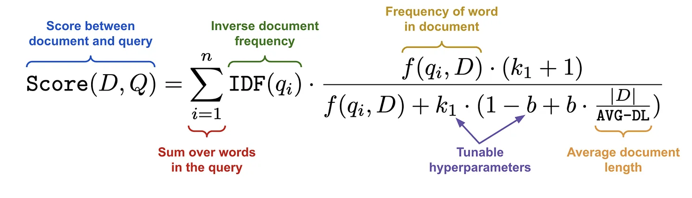

# Retrieval

Retrieval can be defined as the process of finding relevant information from a large collection of data, thus retrieval is at the core of search engines.
The main two steps of a search are:

- Retrieval: From the set of all possible documents, identify a much smaller set of candidate documents that might be relevant to the user’s query.

- Ranking: Use more fine-grained analysis to order the set of candidate documents such that the most relevant documents are shown first.

Depending upon the use case, the total number of documents over which searching could be very large (e.g., all products on Amazon or all web pages on Google). As such, the retrieval component of search must be efficient—it quickly identifies a small subset of documents that are relevant to the user’s query. Once a smaller set of candidate documents are identified, a more complex techniques—such as larger neural networks or more data—to optimally order the candidate set in a manner that is personalized and relevant to the user’s query.
There are different techniques to perform retrieval (and ranking), some of them are more "traditional" and others are more based on "AI".

>**Note:** over the post the assumption is that there is a user query that needs to be compared to a corpus of (textual) documents in order to retrieve the top mathching ones.

## Lexical Search

The traditional approach to building a search engine is based upon matching words in a user’s query to words in a document. This approach, called lexical (or sparse) retrieval, relies upon a data structure called an inverted index to perform efficient keyword matching. The inverted index just contains a list of words and maps each word to a list of locations at which it occurs in various documents. Using this data structure, we can efficiently match terms to documents in which they appear and even count the frequency of terms in each document.
Lexical search algorithms are based upon word frequencies. If a word appears frequently both in the user’s query and a particular document, then this document might be a good match! To represent the space of possible words that can exist in a query or document, we define a fixed-size vocabulary of relevant words.
Therefore, one can represent a sequence of text (i.e., a query or document) with a vector that contains an entry for each word in the vocabulary. Then, each of these entries can be filled with a number (possibly zero) corresponding to the frequency of that word within the text. Because the vocabulary is large and only a (relatively) small number of words occur in any given document, this vector representation is relatively sparse (i.e., a lot of zeros). This method of producing a vector representation from a sequence of text, called the bag of words model, forms the basis of sparse retrieval techniques (i.e., lexical search).
Given a bag of words representation of a query and a set of documents, the primary algorithm used for performing sparse retrieval is the BM25 ranking algorithm; see below. BM25 scores are entirely count-based. We score documents by 1: counting words that co-occur between the query and the document and 2: normalizing these counts by metrics like inverse document frequency (i.e., assigns higher scores to words that occur less frequently in the documents like "the") and relative document length (longer documents will have higher co-occurrence of words with the query because of being longer).

Where:

- $q_i$: Is the $i^{th}$ term in the query.

- $IDF(q_i)$: Is the inverse document frequency of term $q_i$ computed as (in some applications like Lucene) $ln(1 + \frac{docCount - f(q_i) + 0.5}{f(q_i) + 0.5})$ where $docCount$ is the number of the documents and $f(q_i)$ is the number of the term $q_i$ appears. It's used to penalize more terms that appear frequently over a specific document (e.g., 'the').

- $\frac{|D|}{AVG-DL}$: It is the field length normalization, namely it is the length of the document (in words) over the average length of the documents in the corpus. It can be seen as the relative length of the document compared to that of the documents in the corpus. Therefore, it the document is large and the ratio gets bigger the score reduces and the idea is that the longer the document the lower the score to account for the more terms contained by that document.

- $b$: It is a tunable hyperparameter, it's multiplied by the field length normalization term. Therefore, the bigger $b$ the more the effect of the document length compared to the average in the corpus is amplified (a common default value is 0.75 - e.g., in Elasticsearch).

- $f(i, D)$: Is the term frequency, namely how many times the term $i$ appears in the document $D$. It's impact is positive in the score, indeed the more a query term appears in the document the more relevant the document is (aka higher score).

- $k$: It is a tunable hyperparameter, it helps in defining the term frequency saturation, namely how much a single query term affect the entire document score and it does it allowing the term frequency to reach an horizonal aymptote (i.e., saturates). The bigger $k$ the slower the term frequency saturates (a common default value is 1.2 - e.g., in Elasticsearch).

>**Info:** BM25 is built on top of the TF-IDF algorithm. The latter, as BM25, is based upon term frequency (TF) and inverse document frequency (IDF) but unlike TF-IDF it also considers the term frequency saturation and the document length normalization.

Despite its simplicity, BM25 algorithm performs incredibly well and remains the core of many search engines even today.

However, BM25 and lexical search algorithms are not able to take into account the semantic meaning of a sequence of text.

## Vector Search

Vector search is an "AI-based" way of doing retrieval.
In a nutshell it's based on generating vector representations of text sequences able to capture their semanting meaning using deep learning (i.e., neural networks). The deep learning models need to be combined with a retrieve algorithm (aka KNN or ANN), this technique is usually referred as dense retrieval. 

There are two types of models for this purpose, bi-encoders and cross-encorders which are typically implemented using an encoder-only architecture (BERT).

Bi-encoders form the basis of dense retrieval algorithms. At the simplest level, bi-encoders take a sequence of text as input and produce a dense vector as output. However, the vectors produced by bi-encoders are semantically meaningful—similar sequences of text produce vectors that are nearby in the vector space when processed by the bi-encoder.
Then, vector search can be performed by 1. using the bi-encoder to produce a vector for the user’s query and 2. performing vector search to find the most similar documents (e.g., via KNN or ANN and a chosen similarity metric).

Cross-encoders are similar to bi-encoders in that they allow us to score the similarity between two sequences of text. Instead of separately creating a vector for each textual sequence, however, cross-encoders ingest both textual sequences using the same model. The model is trained to predict an accurate similarity score for these textual sequences. Cross-encoders can more accurately predict textual similarity relative to bi-encoders. However, searching for similar documents with a cross-encoder is much more computationally expensive!

Namely, bi-encoders can be combined with vector search to efficiently discover similar documents, but cross-encoders require each textual pair to be passed through the model to receive a score. Searching for the most similar document to a user’s query with a cross-encoder requires that we iteratively compute the similarity between the query and every document. Given that this would be incredibly expensive, cross-encoders are usually only applied at the end of the dense retrieval process (aka the ranking stage). After we have retrieved a set of relevant candidate documents, we can pass these documents through a cross-encoder for more accurate re-ranking.

### KNN

The main backbone of similarity search for vector embeddings are KNN/ANN alogorithms.
They returns the top K neighbors of a query, with the usual trade-off between accuracy and latency/speed. The more accurate the retrieval is the more time it needs.
K-nearest neighbors (KNN) is a simple algorithm that finds k-nearest neighbors points (i.e., vectors) of a given query point.
It's based on computing a metric, usually known as similarity metric, between the query point and all the points in the dataset.
The key point of the KNN is that it does not require any training phase as opposed to other algorithms like SVM, Logistic Regression, etc.
Therefore, with KNN inference is directly applied. When a new object (i.e., point/vector) the algorithm is applied to, it is compared to all the points in the dataset (exhaustive search) and the k-nearest neighbors are selected.
Given that KNN performs an exhaustive search, it is computationally expensive but with highest accuracy. Indeed, for a dataset with $N$ points of dimension $M$ the total time complexity of the algorithm is $O(N)$.
Usually brute-force KNN is not suggested as retrieval method in semantic search. This is because it compares the query vector with all the content in the VDB, leading to an higher latency at inference time. Therefore, Approximate KNN (ANN) is used to reduce retrieval time but preserving good accuracy.

### ANN

To allow ANN some data structures that can be traversed quickly are created when indexing vectors.
Indexing can be defined as the process of smartly storing vector embeddings to optimize the retrieaval process.
Indeed, via indexing the arrangement of vector embeddings is done in a way that similar vectors are somehow grouped together.
Using KNN (brute-force search) leads to a linear time complexity $O(n)$ when comparing a query vector with all the vectors in the database.
The purpose of ANN, achieved via indexing algorithms, is to reduce the complexity to achieve a sub-linear one.
To speed up the search time/inference, which is crucial for large datasets or low latency applications, there are mainly macro possibilities:

- Reduce vector size — through dimensionality reduction or reducing the number of bits representing our vectors values.

- Reduce search scope — via clustering or organizing vectors into tree structures based on certain attributes, similarity, or distance — and restricting our search to closest clusters or filter through most similar branches.

Using either of these approaches means that we are no longer performing an exhaustive nearest-neighbors search but an approximate nearest-neighbors (ANN) search — as we no longer search the entire, full-resolution dataset.

Reducing the search scope is done by using the index (data structure) to focus on just a subset of the vectors (potential candidates).

The main indexing techniques are:

- Flat Index

- Inverted File Index (IVF)

- Hierarchical Navigable Small Worlds (HNSW)

- Locality Sensitive Hashing (LSH)

Before talking about indexing it's important to go over some more concepts about reducing the vectors size like product quantization (PQ) and scalar quantization (SQ).

Vector similarity search can require huge amounts of memory. Indexes containing 1M dense vectors (a small dataset in today’s world) will often require several GBs of memory to store.
The problem of excessive memory usage is exasperated by high-dimensional data, and with ever-increasing dataset sizes, this can very quickly become unmanageable.
Product quantization (PQ) is a popular method for dramatically compressing high-dimensional vectors largely reducing their memory footprint and speeding up the similarity search by exploiting the compressed vectors instead of the raw ones.

Quantization is a generic method that refers to the compression of data into a smaller space.
Quantization is different from dimensionality reduction. Given a vector with dimension $D$ (e.g., 1024) made of 32-bit floats (the scope $S$), dimensionality reduction generates another representation of the raw vector by reducing its dimension $D$ (i.e., $D_{reduced} < D$).
On the other hand, quantization compresses the vector by reducing the scope $S$ rather  than the dimension $D$.

There are many ways of doing this. For example clustering. When clustering a set of vectors the larger scope of potential values (all possible vectors) is replaced with a smaller discrete and symbolic set of centroids.
And this is really the definition in a nutshell of a quantization operation. The transformation of a vector into a space with a finite number of possible values, where those values are symbolic representations of the original vector.

Product quantization (PQ) is a lossy-compression method that compresses the vectors via a three step process:

- It splits each high-dimensional vector into a fixed-equally-sized sub-vectors/chunks.

- For each set of sub-vectors (subspace) a clustering operation is performed, creating multiple centroids for each subspace

- Assigning each of these subvectors to its nearest centroid (also called reproduction/reconstruction value).

- Replace each centroid values with an unique IDs, each representing a centroid.

- Create, for each original high-dimensional vector, a tiny vector of centroid IDs.

At the end of the process the original vector is mapped to a smaller vector of IDs that requires way less memory.

PQ is a compression technique that reduces the dimensionality of the vectors.
Therefore, PQ speeds up the similarity computation becuase it reduces the dimensionality of the embedding vectors and query vectors, but it also reduces the memory footprint of the stored vectors.

Scalar quantization (SQ) is a lossy-compression method that compresses the vectors scope.
SQ takes each dimension of the vector and buckets them into some smaller data type, for instance from float32 to int8.
However, SQ  does not justs rounds the data type but it applies a numerical transformation to the data.

The equations used in Lucene for instance are:

$
int8 \approx \frac{127}{max - min} * (float32 - min)
$

$
float32 \approx \frac{max - min}{127} * (int8 + min)
$

#### Flat Index

A flat index is by and large the most basic indexing strategy, but arguably also the most overlooked. With flat indexing, the query vector is compared with every other vector in the database. Therefore, the index is simply a flat data structure which is exactly the size of the dataset.
Given that in flat index there is no approximation, it gives back the most accurate results but with a slower fashion.
Put in another perspective flat index scales linearly with the size of the dataset, indeed it's characterized by linear time complexity $O(n)$.
Flat index does an exhaustive search of all the vectors in the database to find the nearest neighbors with the query one, thus it computes the similarity between the query vector and all the vectors in the database.
Therefore, the flat indexing is a good choice when the dataset is small because it does not scale well with the size of the dataset.
The flat index can be combined with Product Quantization to reduce the memory footprint of the vectors, this leads to a kind of composite index.

## Inverted File Index (IVF)

The IVF technique is an indexing method that allows for approximate search as opposed to flat index that allows for exact search. Put into another perspective IVF is an approximate nearest neighbor search algorithm that uses a clustering technique to reduce the search space.
The IVF partitions the index (i.e., dataset) into Voronoi cells (clusters) each of them with their own centroid, thus applying a clustering algorithm (e.g., K-means) to the vector embeddings.
Each vector embedding is assigned to the cluster that has the closest centroid, this allows the system not to traverse the entire index to find the nearest neighbors.
Indeed, when a query vector is given the system finds the closest centroid to the query vector and then it performs a (brute-force) search within that cluster of vector embeddings. The IVF needs parameters like the number of clusters/cells (usually called nlist) to partition the index into and the number of clusters/cells to search into (usually called nprobe). The higher the number of clusters to search into, the more time it takes but likely with better accuracy.
IVF is able to speed up the search by reducing the scope of the search space.
Unlike flat index, IVF needs the index to be trained in order to create clusters and centroids.

>**Info:** The main idea of the Voronoi cells (also called Dirichlet tessellation) is to build non intersecting regions where each data point is assigned. Moreover, the property of Voronoi cells is that the distance between the cell centroid an a point of the cell is less than the distance of that point with any other cell centroid.

There are several variants of the IVF.

IVF-Flat, this is the most basic variant of IVF. It is a simple inverted file index that uses a flat index to store the vectors in each cluster. Therefore, when a query vector is given the system finds the closest centroid/s to the query vector and then it performs a (brute-force) search within that cluster/s of vector embeddings.
It's a good balance between accuracy and speed, especially in smalle/medimum-sized datasets where high accuracy is required.

IVF-PQ, this is a variant of IVF that uses product quantization to compress the vectors in each cluster.
When a query vector is given, the system finds the closest centroid/s and perform search within the cluster/s by comparing the compressed query and the compressed vectors in the cluster/s.
Therefore, the IVF-PQ exploits the quicker search due to the restricted search space and it also leads to even faster computation due to a faster similarity calculation due to the compression of vectors. However, PQ is an additional approximation step affecting the similarity calculation.
Therefore, IVF-PQ is a good choice when the dataset is large and the accuracy is not critical becuase it leads to two differnt sources of approximations.

IVF-SQ, this variant of IVF uses scalar quantization to compress the vectors in each cluster.

## Hierarchical Navigable Small Worlds (HNSW)

Hierarchical Navigable Small Wolrd (HNSW) graphs are among the top-performing indexes for vector similarity search.

HNSW is a graph-based indexing technique that is designed to efficiently search for nearest neighbors in high-dimensional spaces.
Its graph-like structure takes inspiration from the probability skip list and the Navigable Small World (NSW).

The skip list is a data structure that combines the quick insertion of a linked list and the fast retrieval of an array. It's based on a multilayer architecture where data is organized accross multiple layers, with each layer containing a subset of the data.
Navigable Small World (NSW) is similar to a proximate graph where nodes are linked together based on how similar they are to each other. The greedy method is used to search for the nearest neighbors.

The HNSW creates a hierarchical, tree-like structure where each node of the tree represents a set of vectors. The edges between the nodes represent the similarity between the vectors. The algorithm starts by creating a set of nodes, each with a small number of vectors. Tis can be done randomly or by clustering the vectors with algorithms like K-means, where each cluster becomes a node.
The algorithm examines the vectors of each node and draws an edge between that node and the nodes that have the most similar vectors to the one it has.
When one queries an HNSW index, it uses this graph to navigate through the tree, visiting the nodes that are most likely to contain the closest vectors to the query vector.

HNSW can be combined with scalar quantization, thus getting the HNSW-SQ index.
HNSW has a time complexity of $O(nlog(n))$ for insertion and $O(log(n))$ for search, where $n$ is the number of vectors in the index.

## Locality Sensitive Hashing (LSH)

Locality Sensitive Hashing (LSH) is a technique used to approximate nearest neighbors in high-dimensional spaces.
LSH maps similar vectors into hash tables ("buckets"), using a set of hashing functions.

To find the nearest neighbors for a given query vector, we use the same hashing functions used to “bucket” similar vectors into hash tables. The query vector is hashed to a particular table and then compared with the other vectors in that same table to find the closest matches. This method is much faster than searching through the entire dataset because there are far fewer vectors in each hash table than in the whole space.

It’s important to remember that LSH is an approximate method, and the quality of the approximation depends on the properties of the hash functions. In general, the more hash functions used, the better the approximation quality will be. However, using a large number of hash functions can be computationally expensive and may not be feasible for large datasets.
LSH is an algorithm characterized by sub-linear time complexity.

The traditional LSH algorithm is based on a three step process (there are other methods like Random Projection):

1. Shingling: It is the process of converting a string of text into a set of ‘shingles’. The process is similar to moving a window of length k down our string of text and taking a picture at each step. We collate all of those pictures to create our set of shingles. Shingling removes duplicates (indeed it creates a set of shingles). Then a sparse vector is created. To do this first all the shingles are pooled into a single set called vocabulary. Then a vector of zeros of length equal to the vocabulary, then for every shingle appearing in the set and in the zero vector a one is placed in the position of the shingle in the vocabulary. This is a sparse vector created via a one-hot encoding.

2. MinHashing: It converts the sparse vector into a smaller dense one. A random minhash function is generated for every position of the dense vector. The minhash function is just a random order of numbers from 1 to the length of the vocabulary.

3. Band and Hash: It takes the signature/dense vectors, hashing segments of each signature and looks for hash collisions. The outptu are vectors of equal length that contains positive integers from one to length of vocabulary. These are then passed to the hash function.

## Similarity Search

Similarity search can be used to compare data quickly. Given a query that can be image, text, video, the similarity search returns relevant results.
In vector similarity search, that is a type of similarity search, a vector representations capturing the semantic meaning of the data are indexed and stored.
There are different types of indexes, one needs to choose based on factors such as dataset size, search frequency, or search-quality vs. search-speed.

The flat index is the easiest one becuause it does not apply any operation to the vectors. Therefore, in flat index there is no training and no parameters to set/optimize.
Because there is no approximation or clustering of vectors — these indexes produce the most accurate results. There is perfect search quality, but this comes at the cost of significant search times.
Therefore with a flat index, given a query vector it's compared using a similarity metric  with all the vectors in the indes.
After computing all the similarities, the results are sorted by the similarity metric and the top-k results are returned.
In other terms, flat index performs an exhaustive search via KNN (also referred as brute-foce KNN).
Flat index is a good choice when the dataset is small, the search frequency is low and the search quality is high priority.

>**Info:** there are several similarity metrics and vector index, in FAISS it has been shown that for larger datasets, the L2 distance is slower than using the inner product.

To reduce the search scope by creating a data structure that can be used to restrict the search space, there are different approaches.

Locality Sensitive Hashing (LSH) works by grouping vectors into buckets by processing each vector through a hash function that maximizes hashing collisions — rather than minimizing as is usual with hashing functions.
Hashing collision is where two different objects (keys) produce the same hash value.

The logic of hashing collision is reverted in LSH because LSH is meant to group similar objects together. When a new query object (or vector) is introduced, the LSH algorithm can be used to find the closest matching groups.

The main parameter of LSH is the nbits, which stands for the 'resolution' of the hashed vector.
The higher the nbits the higher the search accuracy, but at the cost of more memory and higher latency/search time.
The nbits is paired with the dimension of the vectors, therefore LSH suffers from the curse of dimensionality.
Indeed, LSH allows to get quick search with good accuracy but it's ideal for low dimensional vectors or small datasets.

Hierarchical Navigable Small World (HNSW) graphs are another, more recent development in search. HNSW-based ANNS consistently top out as the highest performing indexes.
HNSW is a further adaption of navigable small world (NSW) graphs using probability skip list — where an NSW graph is a graph structure containing vertices connected by edges to their nearest neighbors.
The ‘NSW’ part is due to vertices within these graphs all having a very short average path length to all other vertices within the graph — despite not being directly connected.
At a high level, HNSW graphs are built by taking NSW graphs and breaking them apart into multiple layers. With each incremental layer eliminating intermediate connections between vertices.
For bigger datasets with higher-dimensionality — HNSW graphs are some of the best performing indexes possible.
The HNSW has three parameters:

- M: The number of nearest neighbors that each vertex will connect to.

- efSearch: How many entry points will be explored between layers during the search.

- efConstruction: How many entry points will be explored when building the index.

M and efSearch are positively related with search accuracy, therefore the higher the more accurate is the search. However, as the usual trade-off, higher M and efSearch values will also increase the search time.
Whereas, efConstruction mainly affects the index building time in a positive fashion. However, for high values of M and high query volume the efConstruction can affect even search time (and not only building time).

HNSW gives great search-quality at very fast search-speeds — but there’s always a catch — HNSW indexes take up a significant amount of memory. The increase in memory footprint is due to the M parameter and not the efSearch and efConstruction parameters.
So, where RAM is not a limiting factor HNSW is great as a well-balanced index that one can push to focus more towards quality by increasing the three parameters.

The Inverted File Index (IVF) index consists of search scope reduction through clustering. It’s a very popular index as it’s easy to use, with high search-quality and reasonable search-speed.
It works on the concept of Voronoi diagrams — also called Dirichlet tessellation (a much cooler name).
To understand Voronoi diagrams, we need to imagine the highly-dimensional vectors placed into a 2D space. Then place a few additional points in the 2D space, which will become the ‘cluster’ (Voronoi cells in our case) centroids.
Then extend an equal radius out from each of the centroids. At some point, the circumferences of each cell circle will collide with another — creating the cell edges.
Now, every datapoint will be contained within a cell — and be assigned to that respective centroid.
Just as with other indexes, the query vector is introduced — this query vector must land within one of the cells, at which point it restricts the search scope to that single cell.
But there is a problem if the query vector lands near the edge of a cell — there’s a good chance that its closest other datapoint is contained within a neighboring cell. This is the edge problem.
To mitigate this issue and increase search-quality is increase an index parameter known as the nprobe value. With nprobe one can set the number of neighbor cells to search.
The higher the nprobe the higher the accuracy of the search, but at the cost of higher search time.
Therefore, the two main parameters of IVF are:

- nprobe: The number of cells (clusters) to search.

- nlist: The number of cells (clusters) to create.

A higher nlist means comparing the query vector to more centroid vectors — but after selecting the nearest centroid’s cells to search, there will be fewer vectors within each cell. So, increase nlist to prioritize search-speed.
As for nprobe, that's tje opposite. Increasing nprobe increases the search scope — thus prioritizing search-quality but at the cost of higher search time.
In terms of memory, IVF is a memory-efficient index. Therefore, changing nprobe is not affecting the memory usage and chaning nlist is slightly affecting the memory usage. Indeed, a larger nlist means a marginally more memory requirements.

### Similarity Measures

A crucial step in KNN and ANN is how to assert that two vectors are similar in a high-didimensional space, which in trun means that the vectors (embeddings in this context) carry similar semantic information.
Regarding the choice of the similarity metric, there are several possibilities.
The main ones are:

- L1 distance

- L2 distance

- Cosine similarity

- Dot product

Usually, vector indexes/databases work on positive similarity measures where the higher the measure the more similar the vectors are.
Therefore, some raw similarity measures like the L1 or L2 distances (that are distances indeed) need to be transformed into positive similarity measures.

#### L1 Distance

The L1 distance also called Manhattan or taxicab distance is mainly due to [Hermann Minkowski](https://en.wikipedia.org/wiki/Hermann_Minkowski), a Polish mathematician.
The L1 distance of two vectors $A$ and $B$ is measured by summing up the pairwise absolute differences of the vector components. The smaller the L1 distance the closer the two vectors are in the space.
More formally, give that $A \in \R^N$ and $B \in \R^N$ it's defined as:

$d_1(A, B) := ||A - B||_1 = \sum_{i=1}^{N} |a_i - b_i|$

Therefore, the L1 distance is usually converted into a similarity metric to satisfy what stated above as follows:

$\frac{1}{1 + d_1(A, B)}$

#### L2 Distance

The L2 distance also called Euclidean distance.
It is computed by summingup the pairwise squared differences of the vector components and then taking the square root. It's basically the shortest path between two vectors. The smaller the L2 distance the closer the two vectors are in the space.

More formally, given that $A \in \R^N$ and $B \in \R^N$ it's defined as:

$d_2(A, B) := ||A - B||_2 = \sqrt{\sum_{i=1}^{N} (a_i - b_i)^2}$

Therefore, the L2 distance is usually converted into a similarity metric to satisfy what stated above as follows:

$\frac{1}{1 + d_2(A, B)}$

>**Info:** Computationally speaking the L1 distance is faster to be computed than the L2 distance. This is because the L2 distance requires a square root operation that is more costly than the absolute opertation.

>**Info:** It has been shown in an interesting [paper](https://bib.dbvis.de/uploadedFiles/155.pdf) that when increasing the norm parameter ($k$ in $||X||_k := (\sum_i^N|x_i|^k)^{\frac{1}{k}}$) the accuracy of the distance decreases.

#### Cosine Similarity

In contrast to L1 and L2, cosine similarity does not measure the distance between two vectors but the angle between them in a multi-dimensional space.
Its value is bounded between -1 and 1, where a value of 1 means that the vectors are identical, 0 means that the vectors are unrelated (i.e., orthogonal in algebra jargon), and -1 means that the vectors are opposite.

More formally, given that $A \in \R^N$ and $B \in \R^N$ it's defined as:
$cos(A, B) := \frac{A \cdot B}{||A||_2 \cdot ||B||_2}$

Therefore, the cosine similarity is usually converted into a similarity metric to satisfy what stated above as follows:

$\frac{cos(A, B) + 1}{2}$

#### Dot Product

One drawback of cosine similarity is that it only takes into account the angle between two vectors but not their magnitude, which means that if two vectors point roughly in the same direction but one is much longer than the other, both will still be considered similar. Dot product similarity, also called scalar or inner product similarity, improves that by taking into account both the angle and the magnitude of the vectors, which provides for a more accurate similarity metric. In order to make the magnitude of the vectors irrelevant, dot product similarity requires that the vectors be normalized first, namely a length of 1.

The normalization of a vector $A \in \R^N$ is defined as:

$A^{norm} := \frac{A}{||A||_2} = \frac{A}{\sqrt{\sum_{i=1}^{N} a_i^2}}$

Then, given that $A \in \R^N$ and $B \in \R^N$ dot product it's defined as:

$dot(A^{norm}, B^{norm}) := A^{norm} \cdot B^{norm} = \sum_{i=1}^{N} a_i \cdot b_i$

Then, the dot product is usually converted into a similarity metric to satisfy what stated above as follows:

$\frac{cdot(A^{norm}, B^{norm}) + 1}{2}$

Therefore, the dot product of two vectors of norm 1 is exactly the same as the cosine similarity.

>**Note:** If the vector embeddings are already normalized, then the dot product is the same as the cosine similarity but it's faster to compute because there is no need to compute the magnitude of the vectors (i.e., the denominator of the cosine similarity).